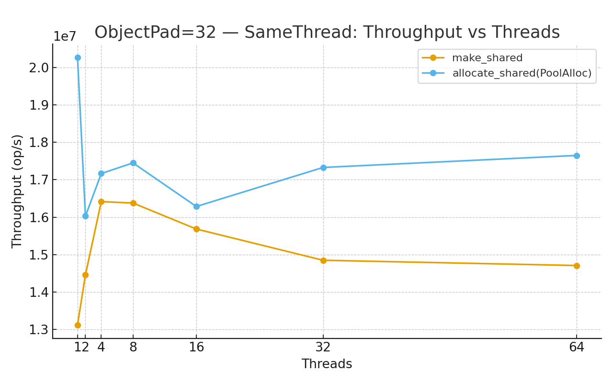
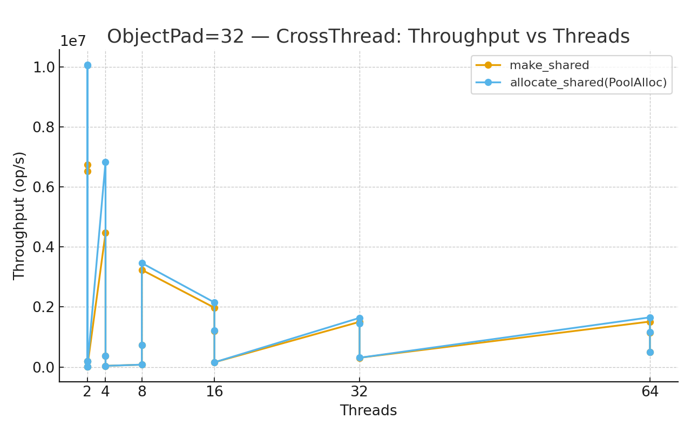
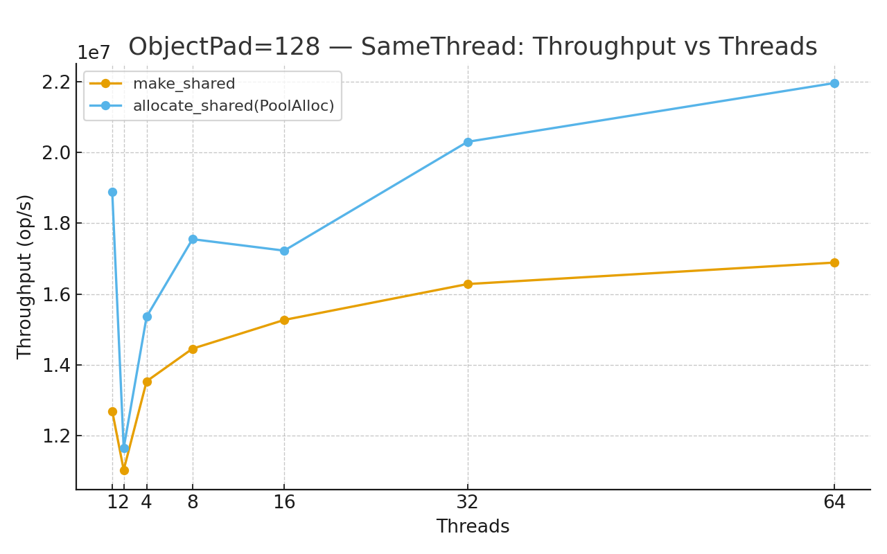
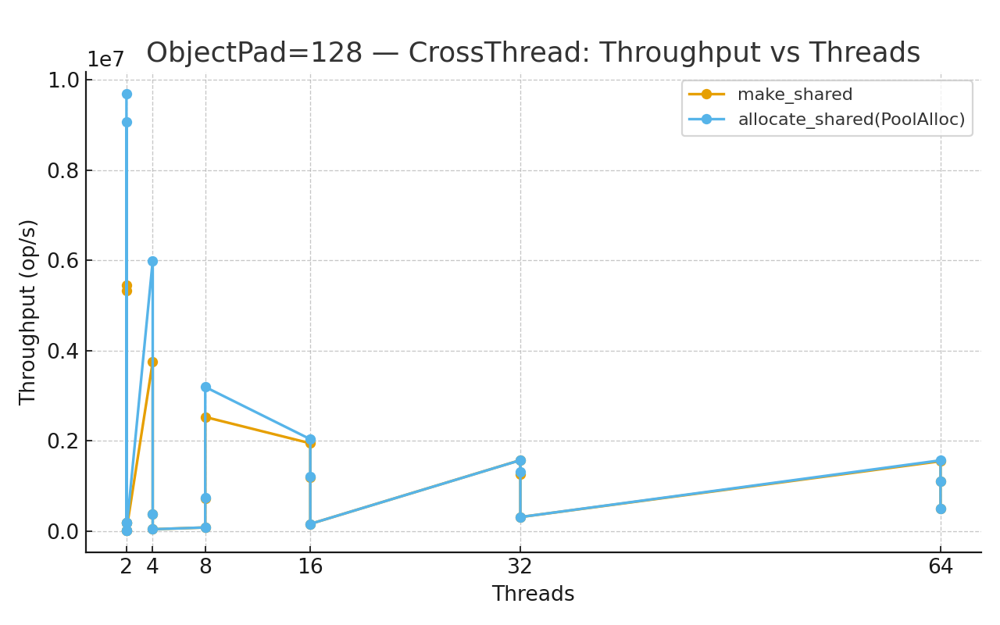
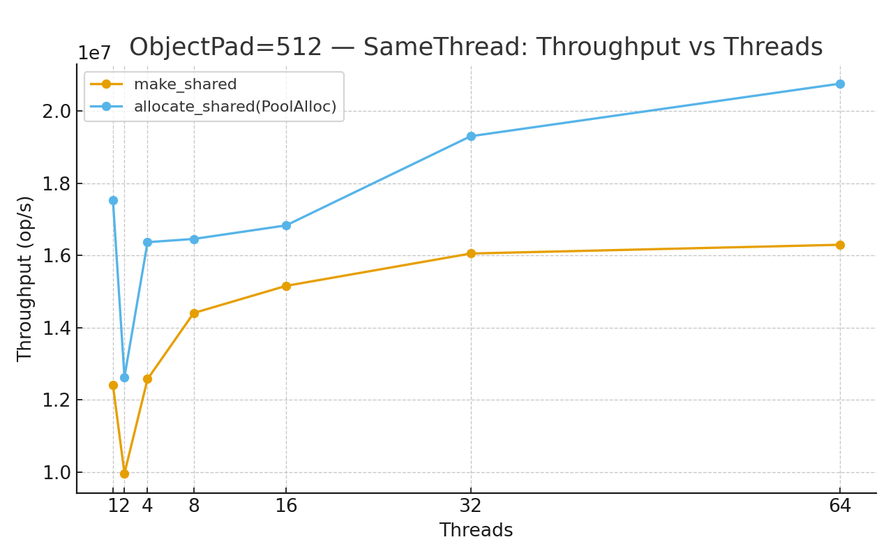
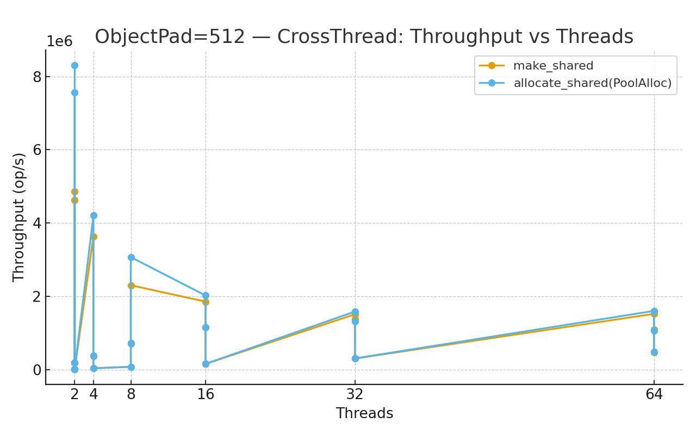
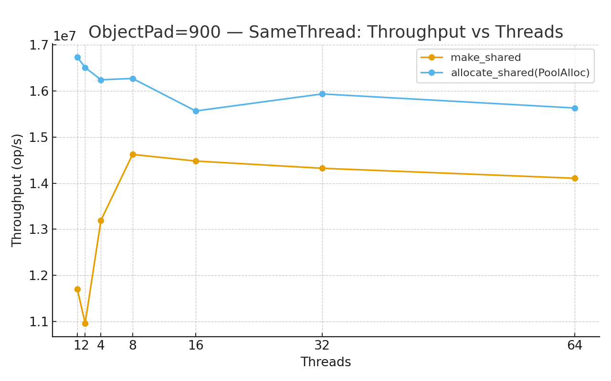
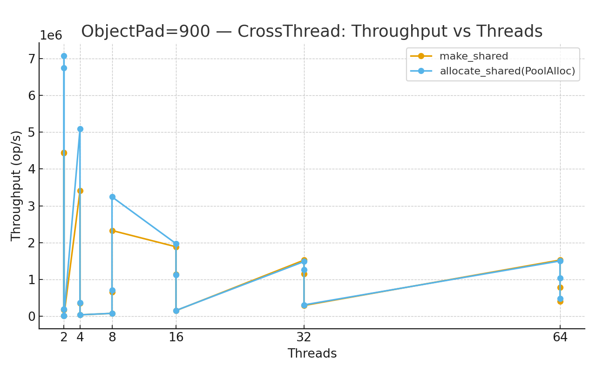

# Custom C++ Memory Pool

🌐 [English](#english-version) | 🇰🇷 [한국어](#한국어-버전)

---

## English Version

High-performance memory pool implementation designed for MMO server development.  
Supports thread-local allocation, lock-free free-lists, and cross-thread deallocation.

### ✨ Features
- **Thread-Local Storage (TLS)**: minimize contention with per-thread pools
- **Lock-Free Stack**: fast alloc/free without locks
- **Cross-Thread Free Handling**: efficiently manages frees from different threads
- **Central Pool Management**: threads borrow chunks from global pool when local is empty
- **Debug & Safety**: underflow/overflow markers, optional tracking

📊 Benchmark
#### ObjectPad = 32
- SameThread  
  
- CrossThread  
  

#### ObjectPad = 128
- SameThread  
  
- CrossThread  
  

#### ObjectPad = 512
- SameThread  
  
- CrossThread  
  

#### ObjectPad = 900
- SameThread  
  
- CrossThread  
  

🔮 Future Improvements

Hugepage alignment

Hazard pointers for lock-free reclamation

## 한국어 버전

MMO 서버 개발을 위해 설계된 고성능 메모리 풀 구현체입니다.  
스레드 로컬 할당, 락프리 구조, 크로스 스레드 해제를 지원합니다.

### ✨ 특징
- **TLS 기반 메모리 풀**: 스레드 단위 풀 관리 → 경쟁 최소화
- **락프리 스택**: 빠른 할당/해제, 락 없이 처리
- **크로스 스레드 Free 처리**: 다른 스레드에서 해제되는 경우에도 효율적 처리
- **중앙 풀 관리**: 로컬 풀이 부족하면 글로벌 풀에서 청크를 빌려 사용
- **디버그 및 안전성**: 언더플로우/오버플로우 마커, 선택적 메모리 추적 기능

---

### 📊 벤치마크
#### ObjectPad = 32
- SameThread  
  
- CrossThread  
  

#### ObjectPad = 128
- SameThread  
  
- CrossThread  
  

#### ObjectPad = 512
- SameThread  
  
- CrossThread  
  

#### ObjectPad = 900
- SameThread  
  
- CrossThread  
  

---

## 한국어 버전

MMO 서버 개발을 위해 설계된 고성능 메모리 풀 구현체입니다.  
스레드 로컬 할당, 락프리 구조, 크로스 스레드 해제를 지원합니다.

### ✨ 특징
- **TLS 기반 메모리 풀**: 스레드 단위 풀 관리 → 경쟁 최소화
- **락프리 스택**: 빠른 할당/해제, 락 없이 처리
- **크로스 스레드 Free 처리**: 다른 스레드에서 해제되는 경우에도 효율적 처리
- **중앙 풀 관리**: 로컬 풀이 부족하면 글로벌 풀에서 청크를 빌려 사용
- **디버그 및 안전성**: 언더플로우/오버플로우 마커, 선택적 메모리 추적 기능

---

### 📊 벤치마크
#### ObjectPad = 32
- SameThread  
  
- CrossThread  
  

#### ObjectPad = 128
- SameThread  
  
- CrossThread  
  

#### ObjectPad = 512
- SameThread  
  
- CrossThread  
  

#### ObjectPad = 900
- SameThread  
  
- CrossThread  
  

---

## 한국어 버전

MMO 서버 개발을 위해 설계된 고성능 메모리 풀 구현체입니다.  
스레드 로컬 할당, 락프리 구조, 크로스 스레드 해제를 지원합니다.

### ✨ 특징
- **TLS 기반 메모리 풀**: 스레드 단위 풀 관리 → 경쟁 최소화
- **락프리 스택**: 빠른 할당/해제, 락 없이 처리
- **크로스 스레드 Free 처리**: 다른 스레드에서 해제되는 경우에도 효율적 처리
- **중앙 풀 관리**: 로컬 풀이 부족하면 글로벌 풀에서 청크를 빌려 사용
- **디버그 및 안전성**: 언더플로우/오버플로우 마커, 선택적 메모리 추적 기능

---

### 📊 벤치마크
#### ObjectPad = 32
- SameThread  
  
- CrossThread  
  

#### ObjectPad = 128
- SameThread  
  
- CrossThread  
  

#### ObjectPad = 512
- SameThread  
  
- CrossThread  
  

#### ObjectPad = 900
- SameThread  
  
- CrossThread  
  

---

### 📊 벤치마크 분석

**SameThread (ST):**  
- ObjectPad 크기가 커질수록 성능이 안정적이거나 약간 향상됨  
- 작은 패드 크기(32)에서는 할당당 오버헤드가 상대적으로 크지만, 128 이상부터는 성능이 안정화  

**CrossThread (CT):**  
- 다른 스레드에서 free가 발생하면 동기화 비용이 추가됨  
- ST 대비 CT는 일관되게 성능이 낮고, 특히 작은 패드 크기(32, 128)에서 차이가 큼  
- 하지만 락프리 설계 덕분에 `new/delete` 대비 여전히 큰 성능 향상 유지  

**종합:**  
- 표준 메모리 할당(`new/delete`) 대비 최소 3배 이상의 성능 향상  
- CrossThread 시나리오는 최악의 경우지만 여전히 충분히 경쟁력 있는 성능 제공  
- 스레드 간 객체 이동이 잦은 MMO 서버 환경에 적합  

---

### 🔮 향후 개선 계획

